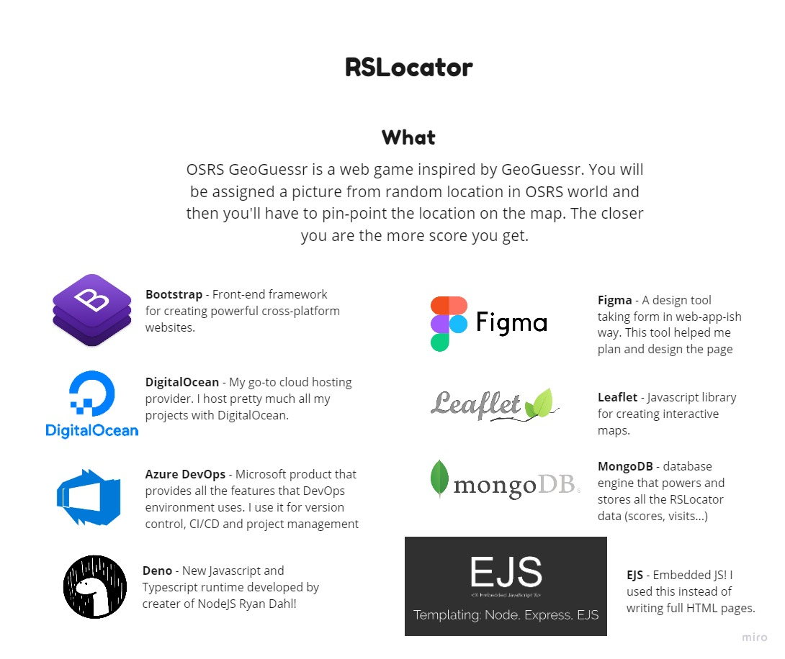
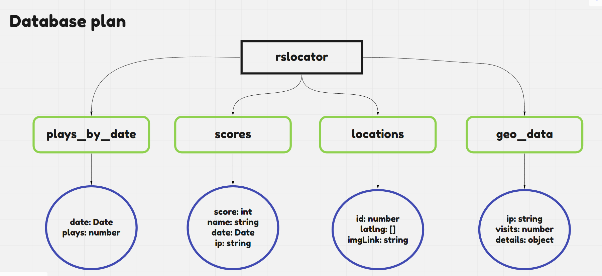

### Here is how it looked

### Plans

### About
RSLocator is a web game inspired by GeoGuessr. You will be assigned a picture from random location in OSRS world and then you'll have to pin-point the location on the map. The closer you are the more score you get.
This was a little project I created around August 2020 and it gained quite a lot of attention. This was to test deno in production and how it handles a lot of users.

### List of features:
- Image of location in Leaflet container
- Scoring system (like GeoGuessr)
- 50 Locations
- 1 game is 10 locations
- Leaderboard (Top 500)
- Back-end authoritative server 